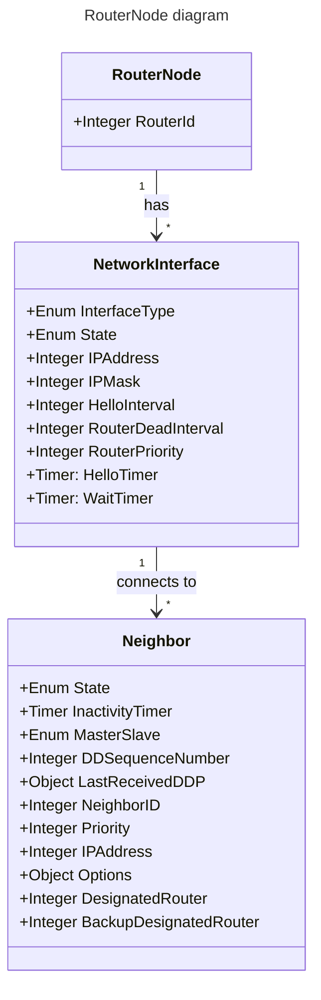

# Class Diagrams

```mermaid
---
title: RouterNode diagram
---
classDiagram
  class RouterNode {
    +Integer RouterId
  }
  class NetworkInterface {
    +Enum InterfaceType
    +Enum State
    +Integer IPAddress
    +Integer IPMask
    +Integer HelloInterval
    +Integer RouterDeadInterval
    +Integer RouterPriority
    +Timer: HelloTimer
    +Timer: WaitTimer
  }
  class Neighbor {
    +Enum State
    +Timer InactivityTimer
    +Enum MasterSlave
    +Integer DDSequenceNumber
    +Object LastReceivedDDP
    +Integer NeighborID
    +Integer Priority
    +Integer IPAddress
    +Object Options
    +Integer DesignatedRouter
    +Integer BackupDesignatedRouter
  }
  RouterNode "1" --> "*" NetworkInterface : has
  NetworkInterface "1" --> "*" Neighbor : connects to

```

  
