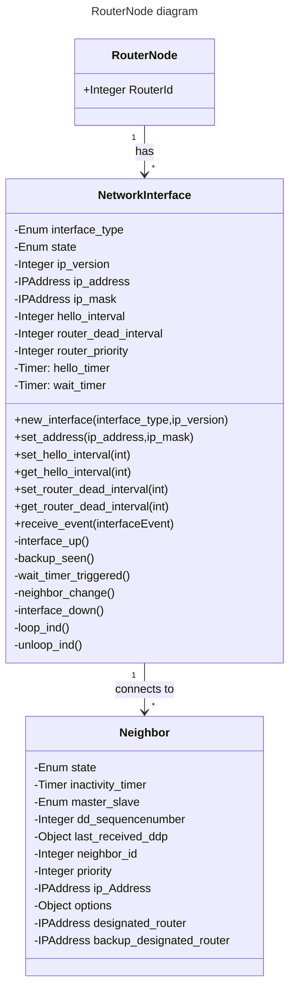

# Class Diagrams

```mermaid
---
title: RouterNode diagram
---
classDiagram
  class RouterNode {
    +Integer RouterId
  }
  class NetworkInterface {
    -Enum interface_type
    -Enum state
    -Integer ip_version
    -IPAddress ip_address
    -IPAddress ip_mask
    -Integer hello_interval
    -Integer router_dead_interval
    -Integer router_priority
    -Timer: hello_timer
    -Timer: wait_timer
    +new_interface(interface_type,ip_version)
    +set_address(ip_address,ip_mask)
    +set_hello_interval(int)
    +get_hello_interval(int)
    +set_router_dead_interval(int)
    +get_router_dead_interval(int)
    +receive_event(interfaceEvent)
    -interface_up()
    -backup_seen()
    -wait_timer_triggered()
    -neighbor_change()
    -interface_down()
    -loop_ind()
    -unloop_ind()
  }
  class Neighbor {
    -Enum state
    -Timer inactivity_timer
    -Enum master_slave
    -Integer dd_sequencenumber
    -Object last_received_ddp
    -Integer neighbor_id
    -Integer priority
    -IPAddress ip_Address
    -Object options
    -IPAddress designated_router
    -IPAddress backup_designated_router
  }
  RouterNode "1" --> "*" NetworkInterface : has
  NetworkInterface "1" --> "*" Neighbor : connects to

```

  
