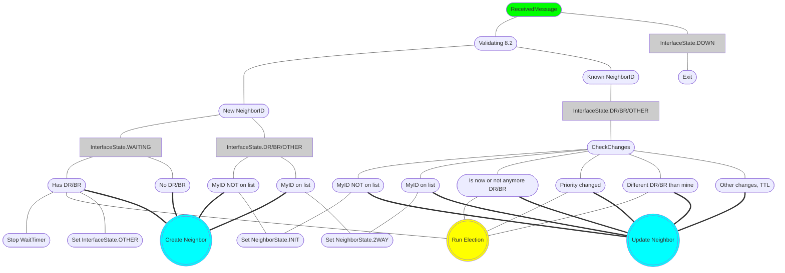

# Neighbor Manager
## Updating Neighbors based on received Hello message

```mermaid
---
title: 
---
flowchart TB
    A([ReceivedMessage])
    style A fill:#0F0
    B([Validating 8.2])

    C1([New NeighborID])
    C2([Known NeighborID])

    I1[InterfaceState.WAITING]
    style I1 fill:#CCC
    I2[InterfaceState.DR/BR/OTHER]
    style I2 fill:#CCC
    I3[InterfaceState.DOWN]
    style I3 fill:#CCC

    R([Exit])

    D1([Has DR/BR])
    D2([No DR/BR])
    E1(((Create Neighbor)))
    style E1 fill:#0FF


    F1([Stop WaitTimer])
    F2(((Run Election)))
    style F2 fill:#FF0
    F3([Set InterfaceState.OTHER])

    J1([MyID on list])
    J2([MyID NOT on list])
    L1([Set NeighborState.INIT])
    L2([Set NeighborState.2WAY])

    G1[InterfaceState.DR/BR/OTHER]
    style G1 fill:#CCC

    H1([CheckChanges])
    K1([MyID on list])
    K2([MyID NOT on list])
    M1([Is now or not anymore DR/BR])
    N1([Priority changed])
    O1([Different DR/BR than mine])
    S1([Other changes, TTL])

    P1(((Update Neighbor)))
    style P1 fill:#0FF

    A---B
    A---I3
    I3---R
    B---C1
    B---C2
    C1---I1
    I1---D1
    I1---D2
    C1---I2
    I2---J2
    I2---J1
    J1===E1
    J1---L2
    J2===E1
    J2---L1
    D2===E1
 
    D1---F1
    D1---F2
    D1---F3
    D1===E1
    C2---G1
    G1---H1
    H1---K2
    K1---L2
    H1---K1
    K2---L1

    H1---M1
    H1---N1
    H1---O1
    H1---S1
    M1---F2
    N1---F2
    O1---F2

    M1===P1
    N1===P1
    O1===P1
    K1===P1
    K2===P1
    S1===P1

```