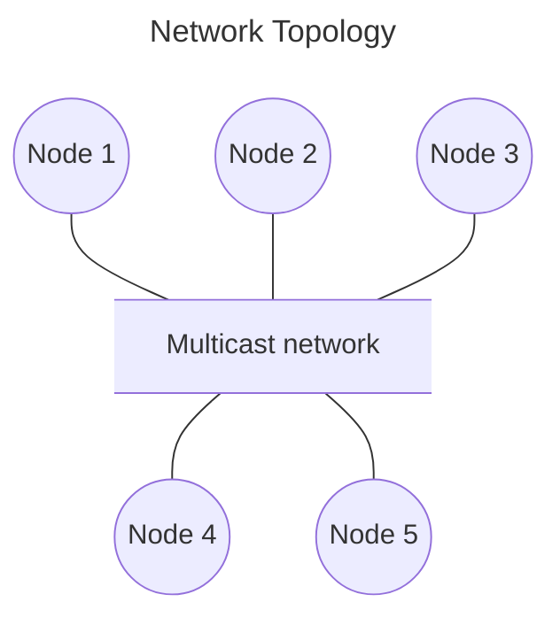
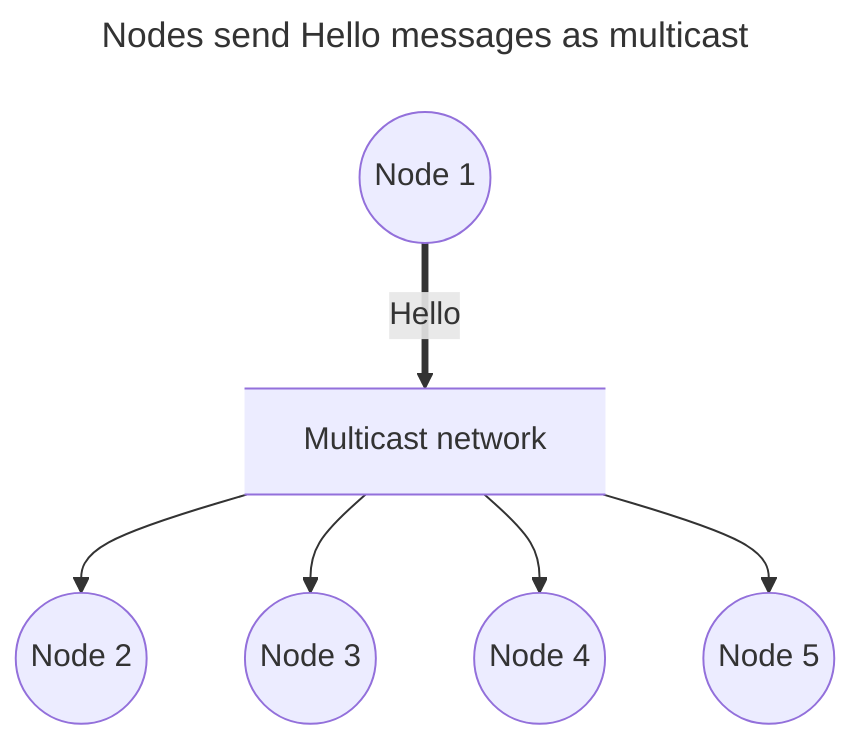

# Base Network Topologies and Node Roles

```mermaid
---
title: Network Topology
---
flowchart TB
    A((Node 1))
    B((Node 2))
    C((Node 3))
    Net@{ "shape": "datastore", "label":"Multicast network" }
    D((Node 4))
    E((Node 5))
    A---Net
    B---Net
    C---Net
    Net---D
    Net---E
```

```mermaid
---
title: Nodes send Hello messages as multicast
---
flowchart TB
    A((Node 1))
    B((Node 2))
    C((Node 3))
    Net@{ "shape": "datastore", "label":"Multicast network" }
    D((Node 4))
    E((Node 5))
    A == Hello ==> Net
    Net --> B
    Net --> C
    Net --> D 
    Net-->E
```
