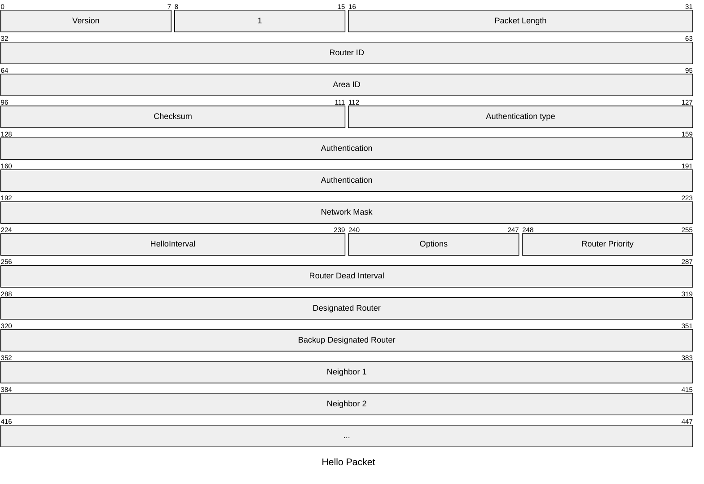

# Structure of Messages

## Hello Packet

```mermaid
---
title: "Hello Packet"
---
packet
+8: "Version"
+8: "1"
+16: "Packet Length"
+32: "Router ID"
+32: "Area ID"
+16: "Checksum"
+16: "Authentication type"
+32: "Authentication"
+32: "Authentication"
+32: "Network Mask"
+16: "HelloInterval"
+8: "Options"
+8: "Router Priority"
+32: "Router Dead Interval"
+32: "Designated Router"
+32: "Backup Designated Router"
+32: "Neighbor 1"
+32: "Neighbor 2"
+32: "..."


```
