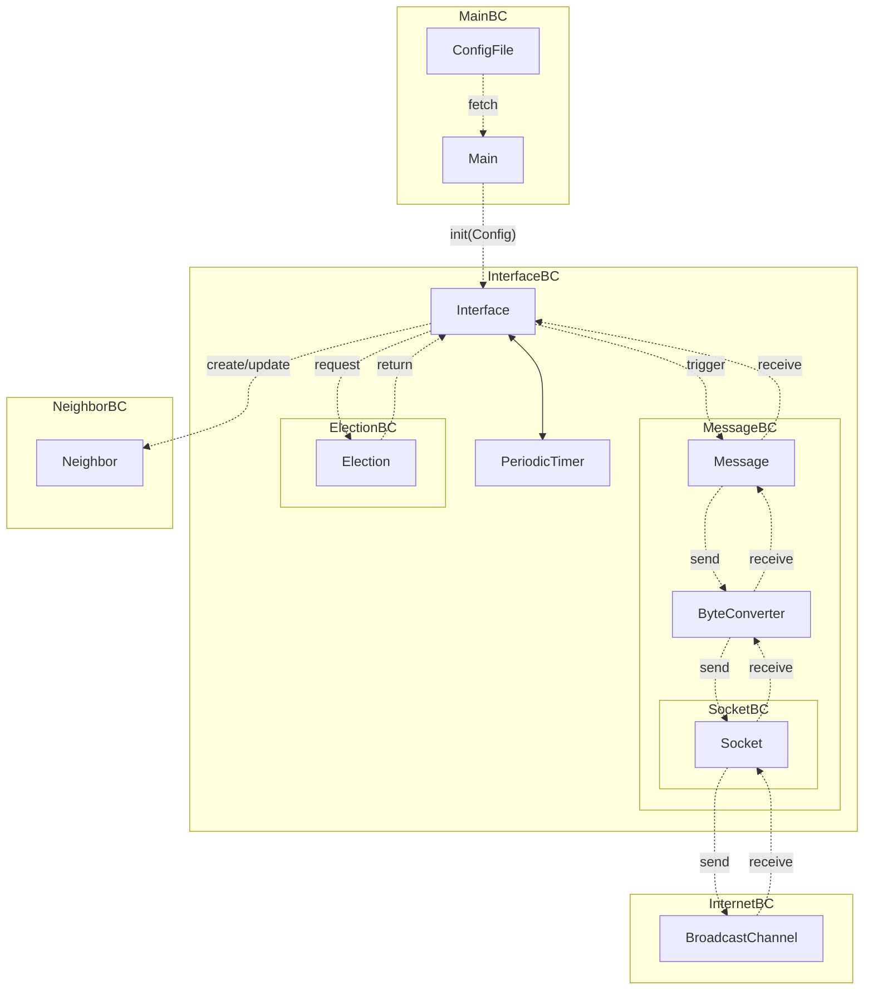

```mermaid

flowchart TB

  subgraph MainBC
    Main[Main]
    File[ConfigFile]
    %%RouterEvent
  end

  subgraph InterfaceBC
    Interface[Interface]
    PeriodicTimer
    %%InterfaceEvent

    subgraph MessageBC
      Message[Message]
      ByteConverter[ByteConverter]

      subgraph SocketBC
        Socket[Socket]
      end
    end

    subgraph ElectionBC
      Election[Election]
    end
  end
  subgraph NeighborBC
    Neighbor[Neighbor]
    %%NeighborEvent
  end
  subgraph InternetBC
    Broadcast[BroadcastChannel]
  end

  File -.fetch.-> Main
  Main -.init(Config).-> Interface

  Interface -.trigger.-> Message
  Message -.send.-> ByteConverter
  ByteConverter -.send.-> Socket
  Socket -.send.-> Broadcast

  Broadcast -.receive.-> Socket
  Socket -.receive.-> ByteConverter
  ByteConverter -.receive.-> Message
  Message -.receive.-> Interface

  Interface -.request.-> Election
  Election -.return.-> Interface
  Interface -.create/update.-> Neighbor

  Interface <--> PeriodicTimer

  %%Interface<-->InterfaceEvent
  %%Neighbor<-->NeighborEvent
  %%Interface-->NeighborEvent
  %%InterfaceEvent-->RouterEvent
  %%NeighborEvent-->RouterEvent
```